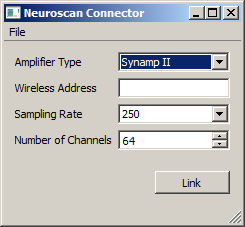
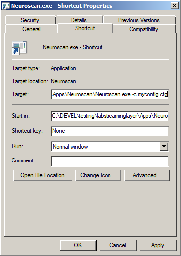

# Overview

This program should work with both the Synamp II and Synamp Wireless product series from Neuroscan (http://www.neuroscan.com/). It still needs to be tested, however.

Before you can use this program you need to obtain and install Neuroscan's Access SDK and the associated license dongle.

# Downloading

Please first check the Releases page to see if there is a release there for you. If not then you may find and old version on the sccn ftp: ftp://sccn.ucsd.edu/pub/software/LSL/Apps/

# Usage

  * Make sure that your amp is turned on and correctly connected.

  * Start the Neuroscan app. You should see a window like the following.
>

  * If you have a Synamp Wireless or other amp connected via a network connection you need to type the correct IP address in. Also select the desired number of channels and sampling rate.

  * To link the application to the LSL, click the "Link" button. If all goes well you should now have a new stream on the network with name "Neuroscan" and type "EEG".

  * For subsequent uses you can save the desired settings from the GUI via File / Save Configuration. If the app is frequently used with different settings you might make a shortcut on the desktop that points to the app and appends to the Target field of the shortcut the snippet `-c name_of_config.cfg` to denote the name of the config file that should be loaded at startup, as in the following screenshot:

> 
